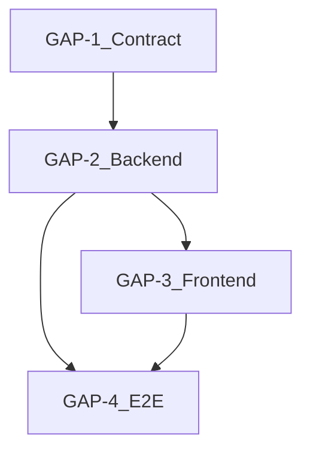

# River Warrior — Gap Remediation Roadmap

**Purpose:** Phased plan from current repository scaffold to full River Warrior capability aligned with [`river_warrior_prd_master.md`](river_warrior_prd_master.md) and verifiable via [`river_warrior_verification_matrix.md`](river_warrior_verification_matrix.md).

**Current baseline:** `contracts/counter` is a plain Rust library (`add` + one test). `backend` is hello-world. `client` is Vite/React template. No Soroban SDK, no deployable contract, no AI or wallet flow.

---

## Gap IDs → Verification

| Gap phase | Delivers | Primary verification rows |
|-----------|----------|----------------------------|
| GAP-1 | Soroban `river_warrior` contract + tests | REQ-C-01 … REQ-C-11 |
| GAP-2 | Backend orchestration + secure admin invoke | REQ-B-01 … REQ-B-05 |
| GAP-3 | Product frontend | REQ-F-01 … REQ-F-03 |
| GAP-4 | Testnet E2E + optional leaderboard | E2E-01 … E2E-04, BONUS-01 |

---

## Phase 1 — GAP-1: Soroban contract foundation

**Objective:** Replace or add a dedicated Soroban contract crate matching the technical PDF (`RiverWarriorContract`, `initialize`, `disburse_reward`, `get_bounty`, `get_total_disbursed`, `set_bounty`, storage keys, events, token transfer).

**Suggested repo layout (choose one):**

- **Option A:** New crate `contracts/river_warrior/` with `name = "river_warrior"`, `crate-type = ["cdylib", "rlib"]`, `soroban-sdk` + `testutils` dev-dep, `#![no_std]`.
- **Option B:** Evolve `contracts/counter` into the real contract (rename package for clarity).

**Tasks:**

1. Add `soroban-sdk` (version aligned with your Stellar/Soroban network — technical PDF cites `21.0.0`; confirm against your CLI/network).
2. Implement `DataKey`, `RiverWarriorContract`, `#[contractimpl]` per PRD REQ-C-02 … REQ-C-10.
3. Add `src/test.rs` (or inline `mod tests`) with **five** tests mirroring technical spec: happy path, double claim panic, total disbursed, unauthorized disburse, set_bounty changes payout.
4. Add release profile per REQ-C-11 (`opt-level = "z"`, `overflow-checks = true`, `lto`, `panic = "abort"`, etc.).
5. Document `soroban contract build` and `cargo test` in repo README.

**Exit criteria:** `cargo test` passes in contract crate; `soroban contract build` produces WASM; verification matrix contract rows executable.

**PRD trace:** REQ-C-01 … REQ-C-11.

---

## Phase 2 — GAP-2: Backend verification and invocation

**Objective:** Service that accepts submission, calls Vision AI, and on `STATUS:VERIFIED` invokes `disburse_reward` with admin credentials; idempotent and auditable.

**Tasks:**

1. Choose stack (technical PDF mentions Node + GPT-4o; repo has Rust `backend` — either extend Rust with HTTP + SDK or add `server/` Node per team preference).
2. Implement upload endpoint + validation (size, type, rate limits).
3. AI adapter: map model output strictly to verified/rejected; log decision id.
4. Soroban RPC client: build invoke transaction as admin; handle errors and retries without double-pay (idempotency key per submission).
5. Configuration: contract id, network, admin secret via environment / secret manager.
6. Integration tests with mocked AI and local/test Soroban or sandbox.

**Exit criteria:** REQ-B-01 … REQ-B-05 satisfied in staging; matrix backend rows pass.

**PRD trace:** REQ-B-01 … REQ-B-06.

---

## Phase 3 — GAP-3: Mobile-first frontend

**Objective:** UI for public key + photo, display AI status, show payout / tx feedback.

**Tasks:**

1. Replace or extend [`client/src/App.tsx`](../client/src/App.tsx) with River Warrior flow (keep build/lint green).
2. Add API client to backend; handle loading and errors (REQ-F-03).
3. Optional: Freighter/connect wallet later; MVP may remain “paste public key” per PDF.

**Exit criteria:** REQ-F-01 … REQ-F-03; `npm run build` + `npm run lint` pass.

**PRD trace:** REQ-F-01 … REQ-F-03.

---

## Phase 4 — GAP-4: Testnet E2E and launch readiness

**Objective:** Repeatable demo on testnet; optional leaderboard.

**Tasks:**

1. Document deploy + init CLI (as in technical README).
2. Run E2E-01 … E2E-04 on testnet; capture script or Makefile targets.
3. Monitor contract USDC balance; alert if low.
4. Optional: Horizon queries for `reward_disbursed` or token transfers for BONUS-01.

**Exit criteria:** Demo script completes in &lt; 2 minutes; evidence attached to verification matrix.

**PRD trace:** Section 7 MVP + bonus; E2E rows in matrix.

---

## Dependency order

---

## Risks and mitigations

| Risk | Mitigation |
|------|------------|
| SDK/network version skew | Pin soroban-sdk + CLI versions; document in README |
| Double pay on retries | Contract claim TTL + backend idempotency keys |
| Collector missing trustline | Pre-flight check + clear UX error (REQ-F-03) |
| Insufficient contract USDC | Balance check before invoke; ops runbook |

---

## Definition of Done (full capability)

- All **REQ-C**, **REQ-B**, **REQ-F** P0 items **Implemented** per master PRD status column.
- Verification matrix: all non-`SMOKE` rows executed with evidence at least once on testnet (P0 E2E).
- README: prerequisites, build, test, deploy, sample invoke, security notes for admin key.
