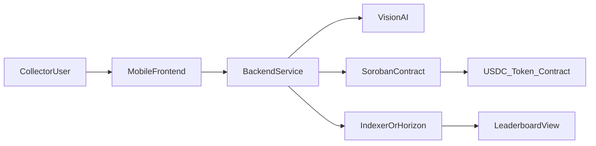

# River Warrior — Master Product Requirements Document (PRD)

**Document version:** 1.0  
**Product:** River Warrior — Stellar dApp, Environmental Bounty Platform  
**Sources:** [`river_warrior_template.pdf`](river_warrior_template.pdf), [`river_warrior_technical.pdf`](river_warrior_technical.pdf), repository implementation as of PRD authoring.

---

## 1. Executive summary

River Warrior compensates informal waste collectors for river cleanup by combining **photo submission**, **Vision AI verification**, and **Soroban smart contract USDC disbursement** to a Stellar wallet. Stellar is used for low fees, fast finality, and trustless payout execution.

**Implementation truth:** This repository currently provides a **scaffold** (Vite/React client, minimal Rust backend binary, placeholder `counter` library). It does **not** yet implement the Soroban contract, AI backend, or wallet integration described in the technical PDF. This PRD states **target** behavior and **current** behavior separately; full capability is defined in [`river_warrior_verification_matrix.md`](river_warrior_verification_matrix.md) and reached via [`river_warrior_gap_remediation.md`](river_warrior_gap_remediation.md).

---

## 2. Problem statement

Informal waste pickers (e.g., along the Pasig River in Metro Manila) collect garbage daily but lack **verifiable proof of effort** and **reliable payment**, so environmental work that benefits the city goes uncompensated.

---

## 3. Solution (one-liner)

User submits a **Stellar public key** and a **photo** of collected trash; **AI** returns verified/rejected; **admin-authorized** Soroban contract **disburses USDC** to the collector’s wallet in ~seconds.

---

## 4. Goals and success metrics

| Goal | Metric / signal |
|------|-----------------|
| Trustless payout after verification | Successful `disburse_reward` on testnet/mainnet with correct USDC amount |
| Abuse resistance | Double-claim and unauthorized invoke paths fail as specified |
| Demo readiness | End-to-end flow completable in &lt; 2 minutes (per template MVP) |
| Transparency | `TotalDisbursed` and/or events consumable for leaderboard (bonus) |

---

## 5. Target users and context

- **Who:** Unbanked informal collectors and urban youth; low income; informal cleanups.
- **Where:** Metro Manila (Pasig/Marikina); expandable to Jakarta, Dhaka, Hanoi.
- **Why:** Immediate USDC reward without bank account; incentive for work already performed.

**Constraints (from template):** SEA region; unbanked user type; Soroban required; mobile-first web; micropayments theme.

---

## 6. Stellar features used (target)

- USDC transfers (via Soroban token interface)
- Soroban smart contracts (escrow / disbursement)
- Trustlines (collector must trust USDC issuer)
- XLM for fees

---

## 7. MVP user journey (target)

1. User pastes **Stellar public key** and captures/uploads **photo** of collected bag (mobile browser).
2. **Vision AI** returns `STATUS:VERIFIED` or `STATUS:REJECTED`.
3. On verified path only: **admin wallet** signs invocation of **`disburse_reward(collector)`** on Soroban.
4. **USDC** arrives in user’s Stellar wallet (~5s).

**Optional (bonus):** Public leaderboard of top earners via Horizon (or similar) — no extra contract complexity required.

---

## 8. System architecture (target)

| Layer | Responsibility |
|-------|----------------|
| **Client** | Key input, photo capture/upload, show AI status, show payout status |
| **Backend** | Call AI, enforce business rules, invoke Soroban with admin key (or HSM), idempotency |
| **Soroban contract** | Store admin, token, bounty; authorize only admin; transfer USDC; anti double-claim; events |
| **Chain** | USDC trustline, fees, finality |

---

## 9. On-chain product requirements (target — from technical spec)

| ID | Requirement | Priority |
|----|-------------|----------|
| **REQ-C-01** | Contract is `no_std` Soroban WASM with `soroban-sdk` | P0 |
| **REQ-C-02** | One-time `initialize(admin, token, bounty_amount)`; panic if re-initialized | P0 |
| **REQ-C-03** | Persistent instance storage: `Admin`, `Token`, `BountyAmount`, `TotalDisbursed` | P0 |
| **REQ-C-04** | `disburse_reward(collector)`: only `admin.require_auth()` | P0 |
| **REQ-C-05** | Temporary storage key `Claimed(collector)` prevents double-claim in period; TTL extension | P0 |
| **REQ-C-06** | Transfer `bounty_amount` from contract to `collector` via token client | P0 |
| **REQ-C-07** | Increment `TotalDisbursed` after successful transfer | P0 |
| **REQ-C-08** | Emit event `reward_disbursed` (or equivalent) with collector + amount for indexing | P1 |
| **REQ-C-09** | Read-only `get_bounty`, `get_total_disbursed` | P1 |
| **REQ-C-10** | `set_bounty(new_amount)` admin-only | P1 |
| **REQ-C-11** | Release profile: size-optimized, `overflow-checks`, `panic = "abort"` for contract | P0 |

---

## 10. Off-chain product requirements (target)

| ID | Requirement | Priority |
|----|-------------|----------|
| **REQ-B-01** | Accept photo + collector public key (or derived address) | P0 |
| **REQ-B-02** | Integrate Vision AI; map model output to verified/rejected | P0 |
| **REQ-B-03** | Only invoke `disburse_reward` when status is verified | P0 |
| **REQ-B-04** | Use admin secret securely (env, KMS, never log) | P0 |
| **REQ-B-05** | Idempotency: same submission must not double-pay if retried | P0 |
| **REQ-B-06** | Optional: Horizon queries for leaderboard / totals | P2 |

---

## 11. Client product requirements (target)

| ID | Requirement | Priority |
|----|-------------|----------|
| **REQ-F-01** | Mobile-first layout for photo + key input | P0 |
| **REQ-F-02** | Clear display of AI result and payout result / tx hash | P0 |
| **REQ-F-03** | Error states: network failure, rejection, trustline missing | P1 |

---

## 12. Security and compliance (target)

- **Auth:** Only designated admin can trigger disbursement on-chain.
- **Double spend:** Contract-level claim window + backend idempotency.
- **Key handling:** User provides **public** key only on client; admin secret only on server.
- **Funds:** Contract holds USDC balance sufficient for bounties; operational monitoring for low balance.
- **AI:** Treat AI as probabilistic; rejected path must never pay; document fraud/abuse limits.

---

## 13. Non-goals (MVP)

- Full KYC on-chain
- Decentralized AI oracle (admin + AI is acceptable for hackathon MVP)
- Multi-token bounties without contract extension

---

## 14. Current implementation reality vs target

This section maps **repository state** to requirements (see also [`river_warrior_gap_remediation.md`](river_warrior_gap_remediation.md)).

| Area | Path / artifact | Status vs target |
|------|------------------|------------------|
| Soroban contract | [`contracts/counter/`](../contracts/counter/) | **Missing** — library `add()` only; no `soroban-sdk`, no `#[contractimpl]` |
| Backend | [`backend/src/main.rs`](../backend/src/main.rs) | **Missing** — prints hello world; no HTTP, no AI, no Soroban invoke |
| Frontend | [`client/src/App.tsx`](../client/src/App.tsx) | **Missing** — Vite/React template; no wallet, photo, or chain flow |
| Tests | `contracts/counter` unit test for `add` | **Partial** — proves Rust toolchain only, not River Warrior |
| Docs / context | `contexts/*.pdf` | **Implemented** — product + technical intent documented |

**Classification legend:** *Implemented* = meets REQ in production-quality form; *Partial* = exists but insufficient; *Missing* = not present.

---

## 15. Normalized requirements register (PDF-derived)

All REQ IDs above are traceable to:

- **Template PDF:** problem, solution, MVP flow, Stellar features, users, bonus leaderboard.
- **Technical PDF:** contract storage, methods, tests, `Cargo.toml`, README build/deploy/invoke.

---

## 16. Out of scope for this document

- Line-by-line audit of third-party AI providers.
- Legal classification of micropayments in each jurisdiction.

---

## 17. Related documents

- [`river_warrior_verification_matrix.md`](river_warrior_verification_matrix.md) — acceptance tests and evidence.
- [`river_warrior_gap_remediation.md`](river_warrior_gap_remediation.md) — phased implementation to full capability.

---

## 18. Document control

| Version | Date | Notes |
|---------|------|--------|
| 1.0 | PRD authoring | Baseline from template + technical PDF + repo scan |
